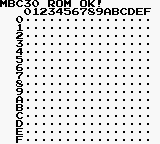
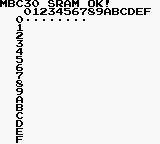
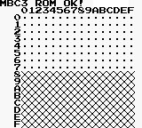
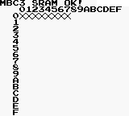

# MBC3 / MBC30 Test ROM

This simple ROM aims to test your Game Boy, emulator, console or whatever that plays Game Boy games to check if it's MBC30-ready. It is inspired by [HyperHacker's MBC3 Tester ROM](https://github.com/EricKirschenmann/MBC3-Tester-gb), but with the addition of testing SRAM as well.

The MBC30 is a variant of the MBC3 mapper that allows for up to 4MB ROM and 64KB SRAM. In contrast, the more common MBC3 mapper only allows up to 2MB ROM and 32KB SRAM.

This source was built for [ASMotor](https://github.com/asmotor/asmotor) (Prebuilt binaries are available [here](https://github.com/ZoomTen/asmotor/releases)).

## Test results

### Full MBC30 support

No X's are to be seen.

### Unsupported / MBC3 only

* **ROM**: X's fill half the table or more. If so, the ROM can be accessed only up to 2MB.
* **SRAM**: X's fill the table and the `MBC3 SRAM OK!` message is displayed. If so, only up to 32KB SRAM is supported.
